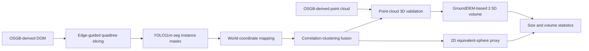

# RockSeg: DOM and OSGB Point-Cloud Rock Fragment Measurement

RockSeg is a research pipeline for detecting and measuring rock fragments in an open-pit scene. It combines a high-resolution digital orthophoto map (DOM) with a point cloud converted from the same photogrammetric OSGB model.

The point cloud used by this project is **not LiDAR data**. The current main experiment uses OSGB-derived surface points for three-dimensional validation and GroundDEM-based 2.5D volume estimation.

Target journal: *Measurement*.

## Project Status

The main single-scene pipeline is operational for a minimum reported equivalent diameter of `0.5 m`:

1. Edge-density-guided quadtree slicing
2. YOLO11m-seg instance segmentation
3. Pixel-to-world coordinate mapping
4. Cross-tile correlation-clustering fusion
5. Point-cloud-assisted 3D validation
6. GroundDEM-based 2.5D volume estimation
7. Comparison with a 2D equivalent-sphere proxy

The current scene does not yet have complete manual detection labels or per-stone volume ground truth. Therefore, the repository reports pipeline statistics and relative method comparisons, but does not claim absolute detection or volume accuracy.

## Method Overview



Convex-hull volume is not part of the main reported volume pipeline. It may be retained only as a separate diagnostic when investigating shell-like point-cloud behavior.

## Current Main Scene

| Item | Current setting |
|---|---|
| Scene ID | `dom2_pointcloud2` |
| DOM | `data/dom2/DOM.tif` |
| World file | `data/dom2/DOM.tfw` |
| Point clouds | `data/pointcloud2/Data/BlockB.laz`, `BlockY.laz` |
| DOM size | 8783 x 21713 pixels |
| Ground resolution | 0.01 m/pixel |
| Coordinate system | EPSG:4536 |
| Scene area | 19070.53 m2 |
| Point-cloud coordinates | Absolute world coordinates, zero XY shift |
| Minimum equivalent diameter | 0.5 m |

All active scripts obtain these paths from `experiments/common/scene_reference.py`. Do not mix `dom2` with `pointcloud3`; those folders represent different exported data products.

## Current Results

The current main run produced:

| Stage or metric | Value |
|---|---:|
| Quadtree tiles generated / retained | 456 / 348 |
| Raw mask candidates | 62,015 |
| Detections after 0.5 m filtering | 7,349 |
| Fusion candidates | 6,258 |
| 3D-accepted fused stones | 6,071 |
| 3D-rejected candidates | 187 |
| Volume QC passed | 6,067 / 6,071 |
| 2.5D total volume | 1271.5422 m3 |
| 2.5D mean volume | 0.2096 m3 |
| 2D proxy total volume | 1699.2841 m3 |
| Pearson correlation, 2D proxy vs. 2.5D | 0.7733 |
| Median 2D proxy / 2.5D ratio | 1.3565 |

These numbers apply only to the current scene and the `0.5 m` minimum equivalent-diameter setting. See [current_results.md](docs/results/current_results.md) and [current_results.json](docs/results/current_results.json) for the repository snapshot used for paper writing.

## Repository Layout

```text
.
|-- README.md
|-- environment.yml
|-- requirements.txt
|-- docs/
|   |-- DATA_SETUP.md
|   |-- PROJECT_INVENTORY.md
|   |-- paper/
|   `-- results/
|-- experiments/
|   |-- common/          # scene reference, spatial index, mask-to-point-cloud crop
|   |-- configs/         # slicing, detection, and fusion parameters
|   |-- slicing/         # SAHI and quadtree slicing
|   |-- detection/       # YOLO instance segmentation and 2D measurements
|   |-- fusion/          # cross-tile fusion and 3D validation
|   |-- volume/          # GroundDEM and volume estimators
|   |-- evaluation/      # optional manual/automatic review tools
|   |-- tuning/          # parameter search utilities
|   |-- visualization/   # full-scene and per-stone inspection
|   |-- reports/         # manuscript table/result exporters
|   `-- utils/           # shared slicing reports and visualizations
|-- models/
|   `-- best.pt          # selected YOLO11m-seg checkpoint
`-- rockseg-references/  # reading notes; publisher PDFs remain local
```

Raw data, full experiment outputs, bulk images, dated runs, and publisher PDFs are intentionally excluded from GitHub.

## Environment

The verified local environment uses Python `3.10`. Create the environment with:

```powershell
conda env create -f environment.yml
conda activate rock
```

GPU users should install the PyTorch build matching their CUDA driver if the generic package selected by `pip` is unsuitable. The repository was most recently run with PyTorch `2.11.0+cu128`, Ultralytics `8.4.60`, Open3D `0.19.0`, laspy `2.7.0`, and Rasterio `1.4.4`.

## Data Setup

The GitHub repository does not contain the multi-gigabyte DOM and LAZ files. Place the data in this exact structure:

```text
data/
|-- dom2/
|   |-- DOM.tif
|   |-- DOM.tfw
|   `-- DOM.prj
`-- pointcloud2/
    `-- Data/
        |-- BlockB.laz
        `-- BlockY.laz
```

Detailed checks and migration guidance are in [DATA_SETUP.md](docs/DATA_SETUP.md).

## Main Run Commands

Run commands from the repository root.

```powershell
# 1. DOM slicing
python experiments/slicing/run_slicing_experiment.py --method quadtree_dom

# 2. Instance segmentation and 2D measurement
python experiments/detection/run_detection_experiment.py --source quadtree_dom

# 3. Cross-tile fusion and point-cloud 3D validation
python experiments/fusion/run_fusion_experiment.py --source quadtree_dom --method correlation_clustering

# 4. GroundDEM-based 2.5D volume and 2D proxy comparison
python experiments/volume/run_volume.py --source quadtree_dom --method correlation_clustering

# 5. Export lightweight manuscript tables and GitHub result snapshots
python experiments/reports/generate_measurement_manuscript_assets.py
```

The full generated outputs remain under `experiments/*/outputs/` and are ignored by Git. Re-running a stage overwrites or refreshes the corresponding local result set.

## Visualization

```powershell
# Full point-cloud scene
python experiments/visualization/view_full_pc.py

# Fused stone masks on the DOM
python experiments/fusion/visualize_fusion.py --source quadtree_dom --method correlation_clustering

# Accepted stones mapped on the point cloud
python experiments/visualization/run_visualize_pc.py --source quadtree_dom --method correlation_clustering --layout scene --mode accepted

# Inspect the DOM and point-cloud correspondence of one stone
python experiments/visualization/view_stone_mapping.py --source quadtree_dom --method correlation_clustering --stone-rank 0
```

`view_convex_hull_diagnostic.py` is a legacy diagnostic for investigating 2.5D versus convex-hull behavior. It is not evidence for the main paper volume comparison.

## Evaluation Boundary

The evaluation directory contains an earlier manual-review workflow and automatic point-cloud heuristics. Existing historical SAHI evaluation files must not be reported as accuracy for the current `quadtree_dom / correlation_clustering` main run.

Before journal submission, the highest-priority missing experiment is a manual detection test set for the current scene, with explicit TP, FP, and FN definitions. Per-stone physical volume ground truth is unavailable, so volume results should be described as estimates and the 2D-versus-2.5D comparison as a relative consistency and bias analysis.

## Paper Materials

- Current methods draft: `docs/paper/measurement_methods_draft.md`
- Results chapter framework: `docs/paper/section_4_results_framework.md`
- Current machine-readable result snapshot: `docs/results/current_results.json`
- Manuscript tables: `docs/results/tables/`
- Repository audit and file classification: `docs/PROJECT_INVENTORY.md`

## GitHub Publication Notes

- GitHub's normal per-file limit is 100 MB. The raw DOM and LAZ files exceed that limit and must remain outside the repository.
- `models/best.pt` is about 45 MB and is already part of Git history. It can remain in the repository, although a release asset is preferable if model versions begin to grow.
- No open-source license has been selected yet. Add a `LICENSE` file before presenting the repository as reusable open-source software.
- Review unpublished mine metadata, manuscript drafts, and model-sharing permissions before making the repository public.
